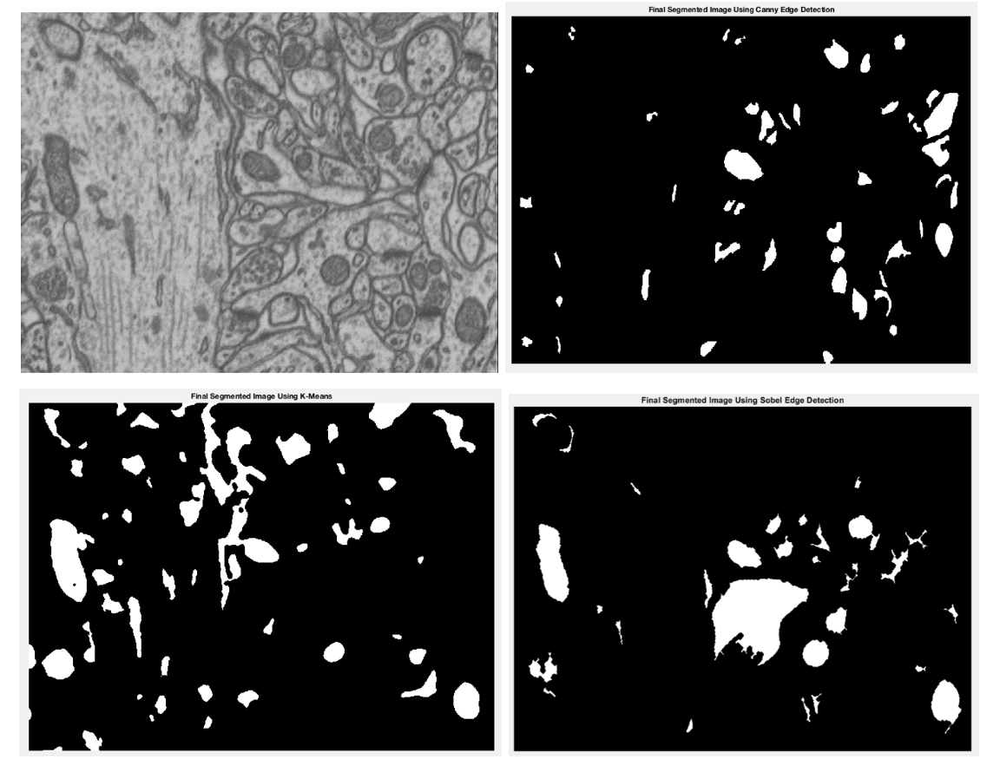

# Mitochondrion Image Segmentation
## Introduction
For our project, we learned about image segmentation through various methods readily available in the field. Matlab has a large Image Processing Toolbox filled with many tools and methods for use in image analysis. We chose three different methods to compare on one, central data set.

## Motivation
In the field of biology and medicine, it is important for scientists and researchers to analyze microscope slides collected. Often, scientists want to isolate cells and their distinct structures. However, analyzing this by hand can be very tedious. To analyze these cells computationally, one must first segment the images for later object recognition. 

## Objective 
For our project, we will tackle the important preprocessing step of image segmentation. Our objective is to segment cells and their parts–in this case, mitochondria. We are concerned with finding an optimization method that yields the best cell segmentation. 

We will segment these images using three methods within the Matlab Image Processing Toolbox:
- K-means clustering
- Sobel edge detection
- Canny edge detection  

We will compare these methods based on their ability to properly segment our data set quantitatively. By means of hyperparameter optimization, we are trying to find the best combination of parameters to get the best performance of each method.

## Dataset
For our data set, we used a Focused Ion Beam Scanning Electron Microscopy (FIB-SEM) image stack (“Electron Microscopy Dataset”). This dataset consists of cells and their mitochondria. We chose this dataset because segmenting cells and their parts is an important feat. Also, this dataset provides a challenge since the mitochondria are a similar color to the cell walls, and the cell walls are the same color as the mitochondria walls. Below is an example of an original image and its corresponding ground truth segmentation of its mitochondria.

## Methods
Below, we delineate three methods we chose to compare: Sobel edge detection, Canny edge detection, and K-means clustering. We validated each algorithm on a set of 20 “training” images. We put training in quotes because we are not training our algorithms here. We are implementing the algorithm and tuning parameters in order to minimize the error between the resulting segmented image and the ground truth segmentation. We explain error in our Results section.

### Sobel Edge Detection

### *Background*
This method involves computing the gradient of the image for each pixel position in the image. A pixel location is declared an edge location if the value of the gradient exceeds some threshold. Edges have higher pixel intensity values than those intensity values surrounding it. So once a threshold is set, we can compare the gradient value to the threshold value and detect an edge whenever the threshold is exceeded.

The Sobel operator performs a 2-D spatial gradient measurement on an image and emphasizes regions of high spatial gradient that correspond to edges. Typically, it is used to find the approximate absolute gradient magnitude at each point in an input grayscale image. Compared to other edge operator, Sobel has two main advantages:

1) With the introduction of the average factor, it has a smoothing effect on the random noise of the image.
2) The elements of the edge on both sides has been enhanced, so the edge seems thick and bright. (Gupta)

### *Implementation*
To implement this method in Matlab, we did the following:
1) Turn the image into binary by threshold (multiplied by a fudge factor)
2) Complement/reverse of the binary image
3) Use Matlab’s edge(A, ‘sobel’) function to detect edges in image A. This method also returns a preliminary threshold for which to run Sobel again.
4) Dilate the Image (Connect the segmented pieces) using Matlab’s imdilate(function)
5) Fill Interior Gaps using imfill() function
6) Remove connected objects on Border using imclearboarder() function
7) Smoothen the objects by eroding thin lines twice
8) Remove objects smaller than minPixels; which we set to 150

### *Tuning*
Binary Fudge Factor (B_FF) {0.7, 0.2, 1.5} - For threshold in step 1 of our Sobel method 
Minimum Number of Pixels (P) {50, 150, 300} - To remove objects in step 8

Table 1: Varying the Parameters of Sobel Method

| Parameters Varied                       | Average Error | Average Runtime(s)  |
| --------------------------------------- | ------------- | ------------------- | 
| B_FF1 , P1        | 0.0544        | 0.0977              | 
| B_FF1 , P2        | 0.0505        | 0.0988              | 
| B_FF1 , P3        | 0.0474        | 0.1005              | 
| B_FF2 , P1        | 0.0496        | 0.0872              | 
| B_FF2 , P2        | 0.0496        | 0.0797              | 
| B_FF2 , P3        | 0.0497        | 0.0790              | 
| B_FF3 , P1        | 0.0497        | 0.0902              | 
| B_FF3 , P2        | 0.0497        | 0.0851              | 
| B_FF3 , P3        | 0.0497        | 0.0844              | 

### *Problems Encountered*
Because the mitochondria objects were so similar in color with the rest of the image, it was very difficult to distinguish the difference of the two. When playing with the contrast of the edges, the sobel method would capture too much of the image and sometimes it would not capture enough of the image. Also, when filling the interior gaps, the imfill() method would fill too many unimportant objects and cause the resulting image to be too messy and inaccurate.

### Canny Edge Detection
Sobel didn’t work very well for the cell image data set, so we wanted to try another edge detection method to determine if edge detection just was not a good approach for this data set. 

### *Background*
Canny edge detection is a popular method for edge detection (Canny). We chose this as one of our algorithms to test on our dataset because it is one of the better methods for edge detection: it extracts the features in an image without disturbing its features (Kaur 15). 

Its core steps are as follows:
- Noise reduction: smooth the image with a Gaussian filter
- Compute gradient of the filtered image
- Find magnitude and orientation of gradient
- Apply non-maximum suppression: remove any unwanted pixels which may not be an edge. Each pixel is checked for if it is a local maximum in its neighborhood in the direction of gradient. 
- Apply hysteresis thresholding, which decides which edges are really edges and which are not. This is done by setting thresholds for minimum and maximum intensity values. If above the maximum, it is surely an edge. If below the minimum, it is discarded. If in between, they are classified based on their connectivity. If they are connected to "sure-edge" pixels, they are considered as part of edges. Otherwise, they are not edges. (“Canny Edge Detection”)

### *Implementation*
To implement this method in Matlab, we did the following:
1) Apply more contrast to the image to make the darker colors darker and the lighter colors lighter
2) Apply a Gaussian filter to smooth the image
3) Use Matlab’s edge(B,'canny') function to detect edges in image B. This method also returns a preliminary threshold for which to run canny again.
4) Run edge(B, 'canny', threshold*fudgeFactor, 0.25), which returns all edges that are stronger than threshold. Here we introduce a fudge factor and a standard deviation of the filter, which is default at 0.25.
5) Dilate the Image (Connect the segmented pieces) using Matlab’s imdilate() fuction.
6) Fill interior gaps using imfill() function
7) Erode the thin lines left over after edge detection step using imerode()
Remove small white specs smaller than 160 pixels using the bwareaopen(Image, 160) function.

### *Tuning*
We varied the following parameters and reported the resulting combination in Table 2.

Sigma (S) {2, 2.5, 3} - for Gaussian Filter   
Fudge Factor (FF) {0.5, 1, 1.6} - to threshold in step 4 of our Canny method 

Table 2: Varying the Parameters of Canny Method

| Parameters Varied                     | Average Error | Average Runtime(s)  |
| ------------------------------------- | ------------- | ------------------- | 
| S1 , FF1        | 0.8692        | 0.2106              | 
| S1 , FF2        | 0.8692        | 0.1785              | 
| S1 , FF3        | 0.1353        | 0.1440              | 
| S2 , FF1        | 0.8349        | 0.1858              | 
| S2 , FF2        | 0.3668        | 0.1748              | 
| S2 , FF3        | 0.0972        | 0.1972              | 
| S3 , FF1        | 0.8092        | 0.2044              | 
| S3 , FF2        | 0.3063        | 0.1714              | 
| S3 , FF3        | 0.0882        | 0.1666              | 

### *Problems Encountered*
The edges of the cells and the mitochondria are similar in color and thickness, so the algorithm did not distinguish between the two very well. Also, when dilating the segmentation in the beginning, it often could not close the gaps for many of the mitochondria edges.

### K-Means Clustering
Edge detection was not producing the best results for our data set, so we chose to turn to an alternative kind of method. We chose a clustering method because we hoped that it would cluster to the correct colors rather than detecting the same edges for the mitochondria and the cells. 

### *Background*
K-means clustering is a method commonly used to partition a data set into k groups automatically. The algorithm selects k initial cluster centers and iteratively refines the clustering to minimize the distance between points and their cluster centers and maximize the distance between clusters (Wagstaff).

### *Implementation*
To implement this method in Matlab, we did the following:
1) Apply a Gaussian filter to smooth the image
2) Use Matlab’s imsegkmeans() function in order to cluster the image 
3) Create a set of 24 Gabor filters that covers 6 wavelengths and 4 orientations
4) Convert the image to grayscale
5) Reformat and smooth the image 
6) Use Matlab’s imsegkmeans() function using our modified image
7) To convert the clustered RGB image into a binary segmented image, create a histogram with 4 bins and find the bin with the minimum amount of white pixels (we assume that the smaller cluster contains the mitochondria). From here, create the binary segmented image.

### *Tuning*
Cluster Size = CS {2,3,4}  
Gaussian Filter = GF {2,2.5,3}

Table 3: Varying the Parameters of K-Means Clustering

| Parameters Varied                      | Average Error | Average Runtime(s)  |
| -------------------------------------- | ------------- | ------------------- | 
| CS1 , GF1        | 0.1010        | 16.1508             | 
| CS1 , GF2        | 0.1043        | 17.6623             | 
| CS1 , GF3        | 0.1225        | 15.7551             | 
| CS2 , GF1        | 0.0933        | 17.8764             | 
| CS2 , GF2        | 0.0810        | 16.3275             | 
| CS2 , GF3        | 0.0771        | 15.5172             | 
| CS3 , GF1        | 0.1039        | 17.0891             | 
| CS3 , GF2        | 0.1042        | 18.3952             | 
| CS3 , GF3        | 0.1173        | 17.6406             | 

### *Problems Encountered*
In developing the finished product of our K-means clustering, we encountered various issues. The main issue was finding a way to turn the clusters, which are in RGB colors into a binary segmented image. A big problem was that the colors chosen for the clusters were not in the same order every time in the image. I spent countless hours testing different approaches to this issue and arrived at a solution that did not work all the time but retrieved the segmentation from the clustering most of the time. Otherwise, it would return the other clusters that did not include the mitochondria, which contributed to a worsened error rate. We assume that the smallest histogram bin contains the cluster with the mitochondria, but since the segmented image is 3 layers, it is not easy to remove the layer that contains the cluster we want since the clusters change colors with each run arbitrarily. 

## Validation
Our algorithm returns a segmented image that we in turn compare computationally with a corresponding ground truth segmented image. To compute the error, we used the L1 norm in which we take the absolute difference of each image’s corresponding pixels (valued at 0 or 1 for black or white respectively) and then take the average.

To validate our algorithms, we continuously tuned different parameters and ran our algorithms on a smaller validation set of 20 images. These images come from a larger training data set, but some of our algorithms were rather slower, so we kept the validation set we ultimately used smaller. Table 4 shows the preliminary results. K-means is clearly slower, and it has worse error than Canny edge detection. So far, Canny seems to be the better method. We did not remove it from the running for best algorithm just yet, since our test data set could reveal different results than anticipated.

Table 4: Validation Preliminary Results 

| Method                | Average Runtime per Segmentation(s) | Average L1 Error  |
| --------------------- | ----------------------------------- | ---------------------------- | 
| Sobel Edge Detection  | 0.0926                              | 0.0505                       | 
| Canny Edge Detection  | 0.1666                              | 0.0882                       |
| K-means Clustering    | 15.7237                             | 0.1043                       |

## Results
Once we finished tuning our parameters on our validation data set, we applied our algorithms on our testing set that we had previously set aside. Our testing set consists of 165 images. 
We achieved the following results:

Table 5: Results

| Method                | Average Runtime per Segmentation(s) | Average L1 Error  |
| --------------------- | ----------------------------------- | ---------------------------- | 
| Sobel Edge Detection  | 0.064                               | 0.0632                       | 
| Canny Edge Detection  | 0.1402                              | 0.1187                       |
| K-means Clustering    | 14.629                              | 0.0746                       |

Interestingly, we produced results that were contrary to our initial validation findings. While earlier K-means was not as good of a segmenter, here it almost took the lead in error rate. Canny edge detection was a good candidate for image segmentation. It produced a relatively low error rate. The method was also quite fast. K-means clustering was another good candidate for image segmentation. However, our implementation was much slower. 

Sobel edge detection had both a lower average run time and average error. Though this may seem like Sobel is the best algorithm for image segmentation, it is important to understand that the error detection comes from the absolute difference. Since Sobel removes more white spots, it might also be removing important identified objects and thus it seems like less error. Quantitatively, Sobel is better. But qualitatively, when looking for segmented mitochondria, Sobel is worse, considering that the removal of important objects defeats the purpose of image segmentation.

With these results, we would use canny or sobel over k-means if we were pressed for time, but not looking for more accurate results. K-means produced a better error rate but was slow.

### *Sample Images from the Best Test Results*

## Discussion, Conclusions, and Future Work
For this project, our group embarked on a challenging journey. Through this process, we learned a lot about Matlab, image segmentation, edge detection, clustering, and more. We did not achieve the best results with the sobel and canny edge detection methods, but we are sure that it is due to the fact that our dataset does not work well with edge detection. The cells and mitochondria have too similar of edges. 

Most of our time was spent reading documentation of these three algorithms. In hindsight, we wish that we had not spent so much time attempting to implement the best version of Sobel and Canny methods for our data set since ultimately, they did not work as well as we had hoped to detect only mitochondria. Canny did achieve low error rates, but not low enough to signify that it only segmented the mitochondria, and not the entire cell. Sobel had a low error rate, but did not detect enough mitochondria qualitatively for the algorithm to be deemed preferable. 

With more time, we would explore alternative options for image segmentation using optimization techniques. We would also improve the K-means implementation since it is rather slow and further improve our error. It had a lot of promise to be a good image segmenter, but time constraints did not allow us to perfect the algorithm for the cell data set.

## Works Cited
“Canny Edge Detection.” Cascade Classification - OpenCV 2.4.13.7 Documentation, Open Source Computer Vision, 18 Dec. 2015, docs.opencv.org/3.1.0/da/d22/tutorial_py_canny.html.

Canny, John. “A Computational Approach to Edge Detection.” IEEE Transactions on Pattern Analysis and Machine Intelligence , PAMI-8, no. 6, Nov. 1986, pp. 679–698., doi:10.1016/b978-0-08-051581-6.50024-6.

“Electron Microscopy Dataset.” Computer Vision Laboratory CVLAB, Ecole Polytechnique Federale De Lausanne, cvlab.epfl.ch/data/data-em/.

Gupta, Samta, and Susmita Ghosh Mazumdar. “Sobel Edge Detection Algorithm.” International Journal of Computer Science and Management Research, vol. 2, no. 2, Feb. 2013, pdfs.semanticscholar.org/6bca/fdf33445585966ee6fb3371dd1ce15241a62.pdf.

Wagstaff, Kiri, et al. “Constrained K-Means Clustering with Background Knowledge.” Proceedings of the Eighteenth International Conference on Machine Learning, 2001, pp. 577–584., web.cse.msu.edu/~cse802/notes/ConstrainedKmeans.pdf.

